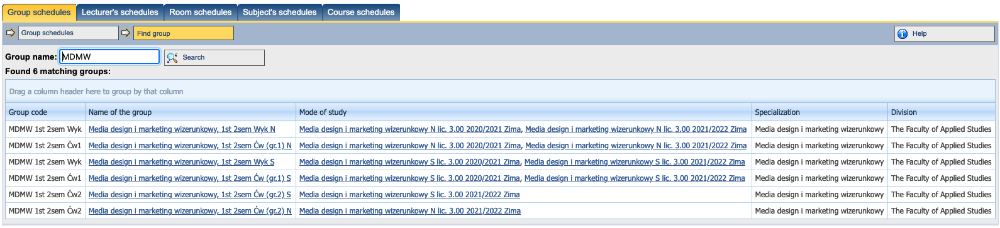
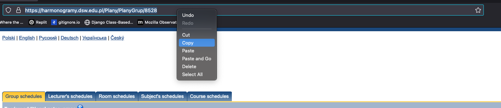
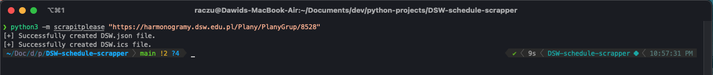

<div id="top"></div>

# Scrap it please


[](https://www.python.org/)

Many colleges do not allow students to download their schedule as a file and only provides a view on their website. The schedule on the website is not one of the best solution, because most would prefer to view it using a calendar app, such as on their phones. Scrap it please also known as a DSW-schedule-scrapper is a tool that was created to help DSW students solve this problem. Keeping it short, by using python, more specificaly [selenium](https://www.selenium.dev/) and [beautiful soup](https://www.selenium.dev/) the script scrapes the whole schedule from the website and saves it to a file that can be imported to calendar app.

## Table of contents

* [Example usage](#example-usage)
* [Requirements](#requirements)
* [Installation](#installation)
* [License](#license)
* [Contact](#contact)

## Example usage

The following example is to show you how to generate a file with a specific schedule.

1. Go to the website https://harmonogramy.dsw.edu.pl/Plany/ZnajdzGrupe and find your group using the search

2. Choose a group from the list and click it

<p align="center">
    
</p>

3. Copy the link to it

<p align="center">
    
</p>

4. Now it's time to run the script! The link you copied earlier will be needed for the script to know where to scrape the data from. To make it run, enter the following command:
    ```
    # Windows
    $ python -m scrapitplease "https://harmonogramy.dsw.edu.pl/Plany/PlanyGrup/8528"

    # Linux/macOS
    $ python3 -m scrapitplease "https://harmonogramy.dsw.edu.pl/Plany/PlanyGrup/8528"
    ```
**:warning: Warning:** Make sure the pasted link is in quotes!

After a short while the script will open the browser, select the proper date on the calendar, then save the data and close the browser. When finished, two messages should pop up informing that the files have been generated corectly.

<p align="center">
    
</p>

Done! The files should appear in the same path which we ran the script. The first one with the `.json` extension may be interesting for some people to use it for something, while we are only intrested in the file `DSW.ics` which is a generated schedule that we can import to any calendar application.


## Requirements

For the script to work properly you must have the following things installed on your computer:
* [Firefox browser](https://www.mozilla.org/en-US/firefox/new/)
* [Python](https://www.python.org/downloads/)

## Installation

The following steps are necessary for the script to be ready to use:

1. Clone the repository or download it as a zip file (if you downloaded the repository as a zip file, make sure you extract it)
    ```
    $ git clone https://github.com/raczu/DSW-schedule-scrapper.git
    $ cd DSW-schedule-scrapper
    ```

2. Create a python virtual environment and activate it (not necessary but it is a good practice, you can skip this part if you want to)
    ```
    # Windows
    $ python -m venv .venv
    $ set-executionpolicy RemoteSigned
    $ source .venv\Scripts\activate.bat
    $ source .venv\Scripts\activate.ps1

    # Linux/macOS
    $ python3 -m venv .venv
    $ source ./venv/bin/activate
    ```

3. Install the requirements
    ```
    $ pip install -r requirements.txt
    ```

**:warning: Warning:** You must have python installed on your computer to perform any of those steps!

## License

Distributed under the MIT License. See `LICENSE` for more information.

## Contact
Feel free to contact: [@raczuu1](https://twitter.com/raczuu1) - kontakt.raczu@gmail.com

Project link: [https://github.com/raczu/DSW-schedule-scrapper](https://github.com/raczu/DSW-schedule-scrapper)
<p align="right">(<a href="#top">back to top</a>)</p>
